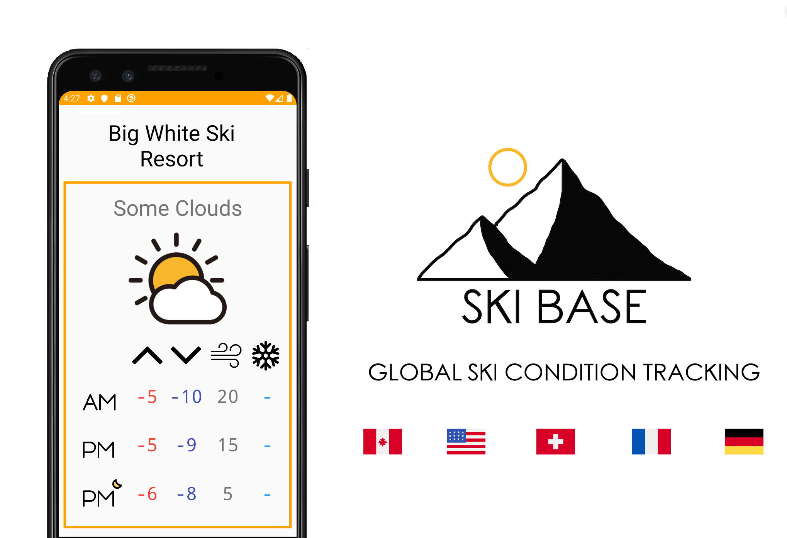
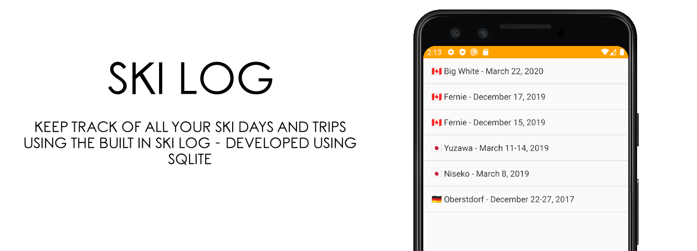

# SKI BASE

Ski Base is an android app that is made to help skiers and snowboarders quickly check mountain conditions for ski hills around the world while tracking their trips. The app was developed using Java, the JSoup web scraping library, and SQLite.

## Getting Started

To run the app on your phone or computer:

1. You'll need a copy of Android Studio and an Android phone or emulator installed
2. Download the repository onto your computer and open it in Android Studio
3. In Android Studio, create an Android Virtual Device (AVD) that the emulator can use to install and run your app.
4. In the toolbar, select the AVD that you want to run your app on from the target device drop-down menu.
5. Click Run
 

### Feedback

I'm always looking for ideas and advice so feel free to contact me if you have any suggestions or if your ski hill is missing from the app
